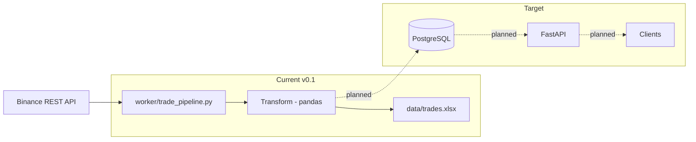

# Architecture

## Overview

Crypto Flow is intentionally split into two hard concerns with no cross-contamination:

- **`worker/`** — pulls data from Binance, transforms it, and persists it
- **`app/`** — serves already-persisted data via HTTP

Analogy: the worker is the factory line; the API is the storefront.

## Data Flow



## Clean Architecture Mapping

| Layer | Location | Responsibility |
| --- | --- | --- |
| HTTP routing | `app/api/` | Request/response, validation, HTTPException |
| Business logic | `app/services/` | Domain rules, orchestration |
| DB access | `app/repositories/` | All SQLAlchemy queries |
| ORM models | `app/models/` | Table definitions |
| DTOs | `app/schema/` | Pydantic input/output contracts |
| Config + DB setup | `app/core/` | Settings, engine, session, logging |
| Ingestion pipeline | `worker/` | External I/O, transformation |

### Rules

- Routers contain HTTP concerns only — no business logic
- Services are framework-agnostic — no FastAPI imports
- Repositories are the only layer that touches SQLAlchemy sessions
- Worker does not import from `app/api/`
- API reads from PostgreSQL — never from Excel

## Repo Structure

```text
app/
  api/           # FastAPI routers + dependencies
  core/          # config, logging, database setup
  models/        # SQLAlchemy ORM models
  repositories/  # DB queries
  schema/        # Pydantic DTOs
  services/      # business logic
  main.py
worker/
  trade_pipeline.py
data/            # temporary artifacts (Excel)
logs/
tests/
docs/
```
